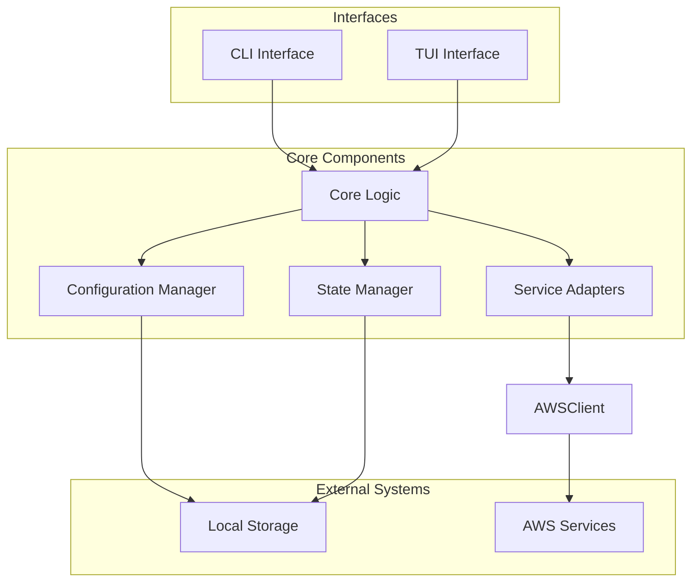
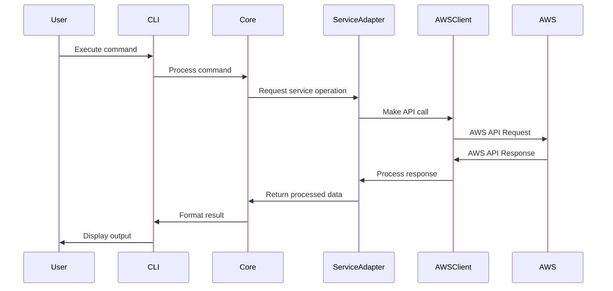
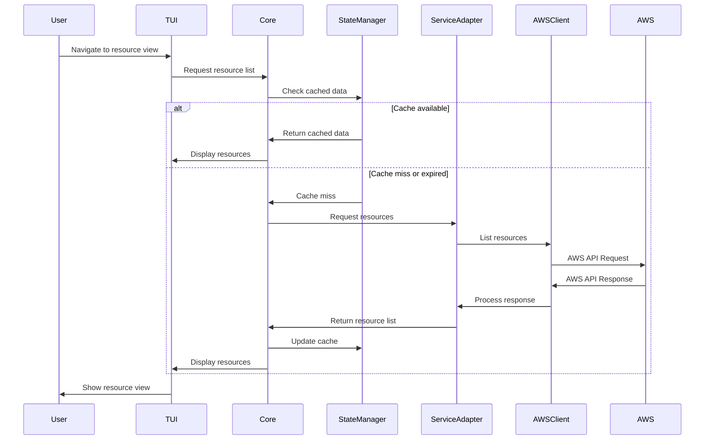
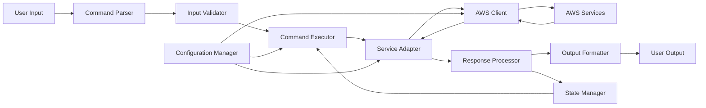
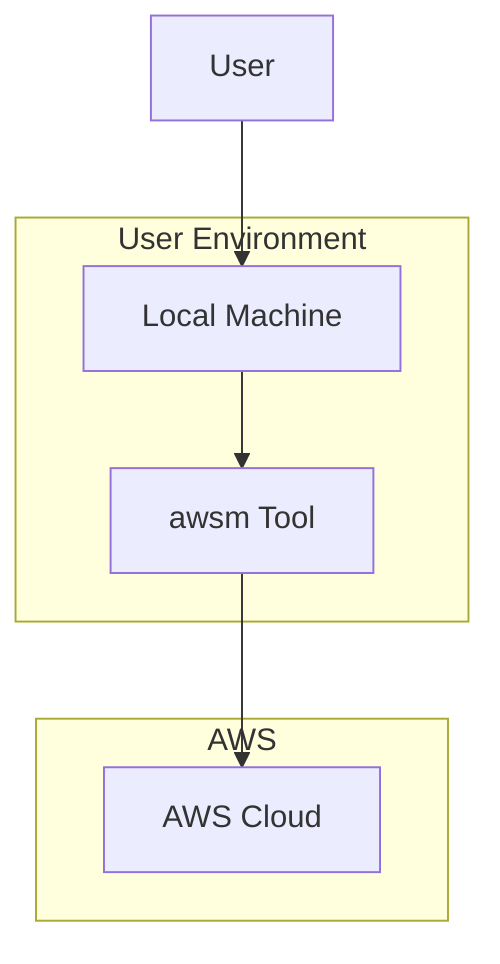

# High-Level Architecture for `awsm` Tool

## Architecture Overview

The `awsm` tool is designed with a modular architecture that supports both command-line and interactive TUI modes while providing a consistent and intuitive interface to AWS services. The architecture follows these key principles:

1. **Separation of Concerns**: Clear separation between UI, business logic, and AWS service interactions
2. **Modularity**: Components can be developed, tested, and extended independently
3. **Extensibility**: Easy to add support for new AWS services and features
4. **Consistency**: Unified experience across CLI and TUI modes

## System Components



### 1. Interface Layer

#### CLI Interface
- Parses command-line arguments and flags
- Provides command completion and help text
- Formats and displays command output
- Handles user input for interactive commands

#### TUI Interface
- Renders interactive terminal UI
- Manages navigation and user input
- Displays resource visualizations and dashboards
- Provides context menus and keyboard shortcuts

### 2. Core Components

#### Core Logic
- Implements the business logic for all commands
- Coordinates between interface and service layers
- Handles error management and recovery
- Implements workflows and automation

#### Service Adapters
- Provides a unified interface to AWS services
- Translates between AWS API responses and internal data models
- Implements service-specific operations and transformations
- Handles pagination, throttling, and other AWS API behaviors

#### Configuration Manager
- Manages user preferences and settings
- Handles AWS credentials and profiles
- Stores and retrieves persistent configuration
- Validates configuration changes

#### State Manager
- Maintains application state
- Caches frequently used data
- Manages history and favorites
- Handles state persistence between sessions

### 3. External Systems

#### AWS Client
- Wraps the AWS SDK
- Handles authentication and session management
- Provides retry logic and error handling
- Optimizes API calls for performance

#### Local Storage
- Stores configuration files
- Caches AWS resource data
- Saves command history and favorites
- Stores user preferences and settings

## Component Interactions

### Command Execution Flow



### TUI Navigation Flow



## Data Flow Architecture



## Module Structure

The application will be organized into the following modules:

```
awsm/
├── cmd/                    # Command-line entry points
│   ├── awsm/               # Main CLI entry point
│   └── awsmd/              # Optional daemon (if needed)
├── internal/               # Internal packages
│   ├── cli/                # CLI interface implementation
│   ├── tui/                # TUI interface implementation
│   ├── core/               # Core business logic
│   ├── config/             # Configuration management
│   ├── state/              # State management
│   ├── aws/                # AWS client and utilities
│   │   ├── client/         # AWS SDK client wrapper
│   │   └── services/       # Service-specific adapters
│   ├── models/             # Data models
│   └── utils/              # Shared utilities
├── pkg/                    # Public packages (for potential reuse)
│   ├── awsutil/            # AWS utilities
│   └── cliutil/            # CLI utilities
└── assets/                 # Static assets
    ├── templates/          # Output templates
    └── themes/             # UI themes
```

## Key Design Decisions

### 1. Mode Switching
The architecture supports seamless switching between CLI and TUI modes, sharing the same core logic and data models. Users can start in CLI mode and switch to TUI for more complex operations.

### 2. Caching Strategy
To improve performance and reduce AWS API calls, the system implements a tiered caching strategy:
- In-memory cache for current session
- Persistent cache for frequently used data
- Time-based cache invalidation
- Manual cache refresh option

### 3. Plugin Architecture
The system is designed with extensibility in mind, allowing for:
- Adding new AWS service support
- Custom commands and workflows
- Output formatters
- TUI view customizations

### 4. Error Handling
A comprehensive error handling strategy includes:
- Detailed error messages with context
- Suggestions for resolution
- Automatic retry for transient errors
- Error logging for troubleshooting

### 5. Configuration Management
Configuration is managed at multiple levels:
- System defaults
- User configuration file
- Environment variables
- Command-line flags
- Per-command overrides

## Deployment Architecture

The `awsm` tool is designed as a standalone application that can be installed and run locally on a user's machine. It does not require any server-side components or external services beyond AWS itself.



## Security Considerations

1. **Credential Management**: Secure handling of AWS credentials, leveraging AWS SDK's credential providers
2. **Minimal Permissions**: Following principle of least privilege for AWS operations
3. **Secure Storage**: Encryption of cached sensitive data
4. **Audit Logging**: Optional logging of commands and operations for audit purposes
5. **MFA Support**: Integration with AWS Multi-Factor Authentication

## Performance Considerations

1. **Efficient API Usage**: Batching and pagination of AWS API calls
2. **Parallel Operations**: Concurrent execution of independent operations
3. **Smart Caching**: Caching frequently used data to reduce API calls
4. **Resource Management**: Careful management of memory and CPU usage
5. **Startup Time**: Fast startup time for CLI operations